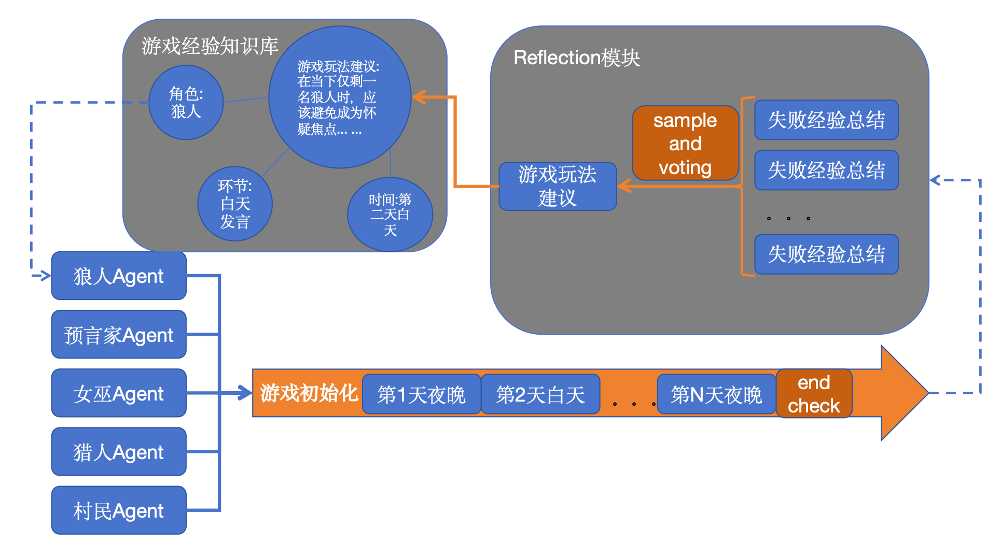
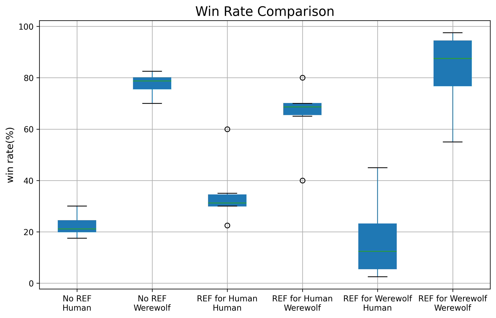

<p align="right">
  <a href="./README.md">中文</a> | <b>English</b>
</p>

# 🐺 LLM Werewolf — A Self-Improving Multi-Agent System via Experiential Memory

An experimental framework that asks a simple question: can a team of LLM agents **improve their win rate through self-reflection alone** — with **no human expert supervision** and **no fine-tuning of model weights**?

Rather than update their parameters, the agents write down what they learn after each game in plain language, then **accumulate, distill, and reuse** that experience from one game to the next. All of the improvement happens at the context and memory layer while the model itself stays fixed — a lightweight, **experience-level form of Recursive Self-Improvement (RSI)**.

<p align="center">
  
</p>

---

## ✨ TL;DR

- 🧠 **Memory-Augmented, Off-Policy Self-Improvement** — agents learn from a **shared pool of experience distilled from every past game**, not just their own last trajectory. This is the key distinction from on-policy, Reflexion-style methods.
- 🔁 **Experience-Level RSI, No Weight Updates** — all improvement comes from **context engineering**: a reflect → distill → store → retrieve → reuse loop, with the base model kept frozen throughout.
- 🗳️ **Self-Consistency for Robust Credit Assignment** — each failure attribution is sampled `k=8` times and kept only when a **>60% majority** agrees, keeping shaky reasoning out of memory in the first place.
- 🧩 **Structured, Generalizable Experience** — every lesson is stored under a validated 5-field schema and forced to be **player-agnostic** (no concrete player IDs), so it carries over to future games instead of overfitting to the one it came from.
- 📈 **Measurable Gains** — with no hand-written strategy at all, self-distilled experience lifted win rate by **+13.5% (village side)** and **+11% (werewolf side)** over a no-memory baseline.

---

## 🎯 Motivation

Most work on "self-improving agents" takes one of two routes: fine-tune the weights, or use **on-policy** self-reflection (e.g. Reflexion), where an agent revises only the trajectory it just produced. This project asks a narrower, cleaner question:

> **Can a frozen LLM improve at a complex multi-agent social-deduction game, using nothing but experience it wrote for itself?**

Werewolf (Mafia) makes a strong testbed. It demands hidden-role reasoning, deception, coalition-building, and credit assignment over a long game. At the same time, the win/loss outcome is an **unambiguous reward signal**, while the game itself offers **no ground-truth labels** to imitate. That combination is exactly what makes it well suited to studying unsupervised self-improvement.

---

## 🏗️ How It Works

The system runs a full **experience loop** around a **frozen base LLM**:

```
        ┌─────────────────────────────────────────────────────────┐
        │                  Shared Experience Pool                  │
        │            (structured advice, persisted on disk)        │
        └───────────────▲─────────────────────────────┬───────────┘
                        │ store (distilled lessons)    │ retrieve (by role/phase/skill)
                        │                               ▼
   ┌────────────────────┴────────┐        ┌────────────────────────────┐
   │   Post-Game Self-Reflection │        │   In-Game Decision Making   │
   │   (credit assignment +      │◄───────│   8 role-conditioned agents │
   │    lesson distillation)     │  loss  │   with information isolation │
   └─────────────────────────────┘        └────────────────────────────┘
```

### 1. In-Game: Role-Conditioned Multi-Agent Play

- **8 agents, one frozen model.** Each of the 8 players is an independent instance of the same LLM, differentiated only by a **role-conditioned system prompt** (Seer / Witch / Hunter / 2× Villager / 3× Werewolf).
- **Strict information isolation.** What each agent can see is controlled by a per-role log filter: werewolves see the night kill discussion, the Seer sees its own check results, the Witch sees its potion history, and villagers see only public speech. Deduction then has to come from actual play rather than leaked information.
- **Phased gameplay.** Sequential day speeches (later speakers see earlier ones) → day vote → night werewolf discussion & kill → role skills (check / heal / poison / hunter's shot).
- **Experience injection.** At each decision point, relevant past advice is retrieved and appended to the prompt as `<建议>…</建议>` blocks — the agent decides *with* the benefit of prior games.

### 2. Post-Game: Self-Reflection & Experience Distillation

Triggered after **every** game, attributing the loss to the **losing side** only:

**Step 1 — Credit Assignment (with Self-Consistency).** The full game log is replayed to the model **8 times** (`temp=0.5`), each time asking *"which player on the losing side was most responsible, and why?"*. The 8 answers go through a **majority vote**, and a lesson is extracted only when **more than 60% agree** on the same player — otherwise the game produces no memory at all. Attribution is the noisiest, longest-context step in the pipeline, and this vote is a filter built specifically for it.

**Step 2 — Lesson Distillation.** The agreed-upon failure is distilled into a single structured lesson.

### 3. Memory: Structured, Validated, Generalizable

Each lesson is stored as a **5-field schema**:

| Field | Purpose |
|-------|---------|
| `role` (角色职业) | Which role the lesson applies to |
| `advice` (游戏建议) | The distilled, actionable lesson |
| `phase` (游戏环节) | Day/night & round |
| `skill` (游戏技能) | The specific decision type (speech / vote / poison / …) |
| `situation` (游戏局面) | The board state the lesson applies to |

Before entering memory, every lesson passes a **validation gate**:

- ✅ All fields present and drawn from the allowed vocabularies
- ✅ **Player-agnostic** — advice containing concrete player IDs is rejected, forcing lessons to generalize
- 🔁 Up to 3 regeneration retries on malformed output
- 🧷 **De-duplication / merging** — lessons sharing the same `(role, phase, skill)` key are merged rather than duplicated

This is why **350 games distill down to just 295 reusable lessons**: the pipeline actively filters and consolidates rather than logging every game verbatim.

### 4. Retrieval & Reuse (Off-Policy)

At each decision point, the system matches the **current `(role, phase, skill)`** against the shared pool and injects the retrieved advice into the prompt. The key is that this pool draws on experience from **all players across all past games**. A move made today can therefore lean on a lesson that a different agent learned the hard way in an entirely different game. **This cross-game, cross-agent reuse is what makes the learning off-policy**, and sets it apart from on-policy self-reflection.

---

## 📊 Results

Starting from **zero hand-written strategy**, the agents played **350 self-play games** and distilled **295 validated lessons**. Turning on experience retrieval for one side at a time, measured against a no-memory baseline:

<p align="center">
  
</p>

| Setting | Win-rate lift vs. baseline |
|---------|:--------------------------:|
| 🧑 Village side uses distilled experience | **+13.5%** |
| 🐺 Werewolf side uses distilled experience | **+11%** |

The takeaway: **experience the agents wrote for themselves, with no supervision, measurably improves play on both the cooperative village side and the adversarial, deception-heavy werewolf side** — all without touching a single model weight.

---

## 🧠 Where This Sits in the Landscape

| Approach | Learning signal | What updates | Policy |
|----------|----------------|--------------|:------:|
| RLHF / Fine-tuning | Human labels / reward | Model weights | — |
| Reflexion | Self-reflection | Own recent trajectory | On-policy |
| **This project** | **Self-reflection + game outcome** | **Shared experience memory** | **Off-policy** |

Related themes: *memory-augmented agents, agentic self-improvement, experiential / test-time learning, self-consistency, context engineering, and a lightweight (experience-level) take on Recursive Self-Improvement (RSI).*

> **Scope note:** "RSI" here refers to improvement at the **experience/memory layer**, not recursive modification of the model's own weights or architecture. The base model stays frozen throughout.

---

## 🎲 Game Rules (Simplified Werewolf)

- **8 players:** 3 special roles (Seer, Witch, Hunter) + 2 Villagers + 3 Werewolves. Werewolves win by wiping out either the special roles or the villagers.
- No sheriff election / badge-passing phase.
- On a tied day vote, one tied player is eliminated at random (no second debate round).
- The Hunter can trigger the revenge-shot on elimination by any cause, as long as the game is still ongoing.

---

## 🚀 Getting Started

```bash
# Clone the repository
git clone https://github.com/demon1011/LLM_werewolf.git

# Enter the project directory
cd LLM_werewolf

# Install dependencies
pip install -r requirements.txt

# Run
python -m main
```

> **Note:** the project runs on top of a large language model API. Before running, configure your own model endpoint and API credentials in `base_llm.py`.

---

## 🗺️ Roadmap / Future Work

- **Explore–exploit balance** — smarter strategy sampling so promising-but-rare lessons still get tried.
- **Overfitting control** — detecting and pruning experience that overfits to specific opponents or game configurations.
- **Retrieval quality** — moving from tag-based filtering toward relevance-ranked (top-k) retrieval, and richer memory indexing, to raise the precision of which lessons an agent actually sees.
- **Continual accumulation** — scaling the experience pool over many more games and measuring how gains compound.

---

## 📁 Project Structure

| Module | File | Role |
|--------|------|------|
| Entry point | `main.py` | Game loop + post-game reflection |
| Game setup | `game_init.py` | Role assignment & agent instantiation |
| Day / Night phases | `day.py`, `night.py` | Phase orchestration |
| Agents | `characters.py`, `system_prompt.py` | Role-conditioned agent behavior |
| Reflection | `reflection.py`, `utils/reflection_process.py` | Credit assignment & lesson distillation |
| Memory | `memory_admin.py` | Experience storage / retrieval |
| Game control | `utils/control_process.py` | Speech / vote / skill flow |
| Logging & visibility | `logger.py` | Per-role information isolation |
| LLM backend | `base_llm.py` | Wraps the underlying LLM API calls |

---

## 📜 License

Released under the [MIT License](LICENSE). See the LICENSE file for details.

For any questions, feel free to reach out: **184380405@qq.com**
