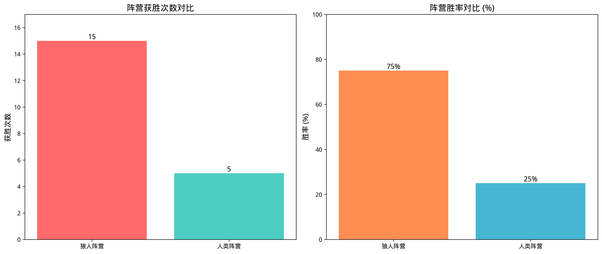
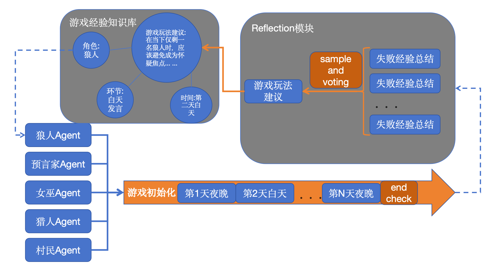

# 基于verbalized off-policy RL的自进化狼人杀Agent

## 简介
这个小项目的主要是通过狼人杀游戏验证基于self-reflection的.off-policy reinforcement learning能否在没有人类专家监督的帮助下通过自我总结提高能力(本项目中评估Agent能力的指标为游戏胜率)。
为了简化流程，本游戏相比正常的狼人杀游戏会少很多环节，主要规则如下：
-游戏的狼人杀游戏为8人局，3神(预言家、女巫、猎人)、2村民和3狼人，狼人的胜利条件为屠单边；
-游戏中没有竞选警长和移交警徽流的环节；
-当白天投票环节出现平票时没有二次辩论，而是会随机选择其中一位玩家消灭；
-猎人无论以任何原因出局，只要游戏还没结束，就可以触发猎枪复仇的技能；

在Agent构建方面，除了游戏规则和游戏环节的介绍，我在初始的prompt中不会加入任何与游戏经验相关的内容，所有的经验均由Agent自己探索总结得到，初始的游戏胜率如下：


## 核心框架
本项目主要的框架基于self-reflection的构建，主要框架如下图：

-和reflexion等on-policy RL不同，本项目在狼人杀游戏中尝试以“游戏建议”等长期记忆为载体，构建off policy的学习方式；
-在一些如如失败原因归因或游戏经验总结等长上下文的环节，会通过self-consistency等方法来缓解LLM由于幻觉等原因导致输出不稳定的问题；œ
-通过知识图谱构建游戏建议的索引，提高建议检索的精准度；

## 安装步骤
```bash
# 克隆仓库
git clone https://github.com/demon1011/LLM_werewolf.git

# 进入项目目录
cd werewolf

# 安装依赖
pip install -r requirements.txt


## 使用方法
python -m main

## 实验结果与讨论	
经过本项目的探索，在350次实验后获得了295条有效经验，分别只允许人类阵营的玩家或狼人玩家检索并遵循游戏经验参与游戏后，胜率如下所示：

不足和未来工作：
-持续积累游戏经验；
-优化经验获取环节，包括explore和exploition的平衡，过拟合经验的筛选和去除等；
-优化记忆存储格式和索引形式，提高Agent使用经验的精度；

## 许可证
本项目采用 [MIT许可证](LICENSE) - 详情见LICENSE文件	
如有任何问题，请联系184380405@qq.com
